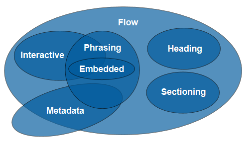

## What is HTML?

<b>HT</b> - HyperText: Text document having references to other text documents.

<b>M</b> - Markup: Processing, defining & presentation of data

<b>L</b> - Language: Syntactical writings

Also;

<b>Hypermedia:</b> Documents including references to text and multi-medias (audio, video, images).

## Standard HTML versions

- HTML4, HTML4.01 ( W3C )
- XHTML 1.0 ( W3C )
- HTML ( WHATWG: browser vendors )
- HTML5 ( WHATWG + W3C )
- HTML ( WHATWG ) [Evolving]
- HTML5 ( W3C ) [Standard]

## DOCTYPE

HTML5 doctype

    <?doctype html>

Valid doctype:

    <?DOCTYPE html>
    <?DocType hTmL>

[ `<?doctype` should not have spaces ]

Notes:

- defines which html standard to use
- prevents rendering in `quirks` or non-standard mode. (Unusual rendering of styles)
- is case-insensitive

## Content Models

1. Flow Content (Block-level)
2. Phrasing Content (Inline-elements)
3. Heading Content
4. Sectioning Content
5. Interactive Content
6. Embedded Content
7. Metadata Content

[Note: Elements can have elements of its subsets as nesting]

Eg;

- Elements of Flow set can have elements of Phrasing set as nesting.
- But elements of Phrasing set cannot have elements of Flow set as nesting.

## HTML Document Structure

    <!DOCTYPE html>
    <html>
      <head>
        <title>Page Title</title>
      </head>
    <body>
      <header>
        <nav>
          <!-- Navigation Menu -->
        </nav>
      </header>

      <section>
        <article>
          <!-- Contents -->
        </article>
      </section>

      <aside>
        <!-- Side Bar -->
      </aside>

      <footer>
        <!-- Page Footer -->
      </footer>
    </body>
    </html>

Notes:

- not a mandatory structure
- helps better structuring and understanding contents
- may help in SEO

[HTML is processed sequentially fro top-to-bottom]
