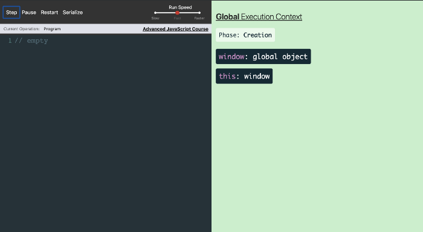
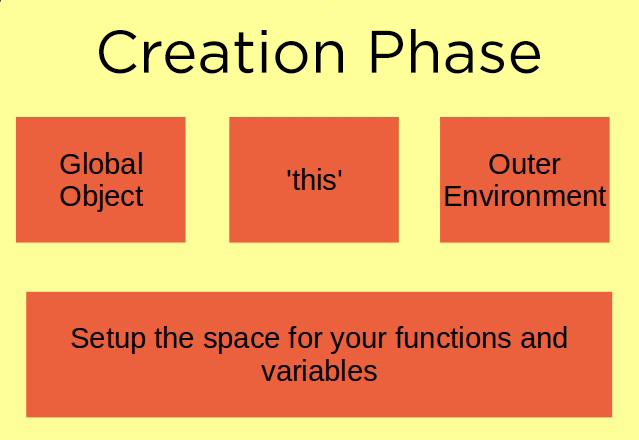
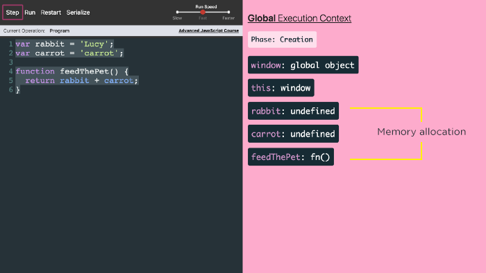
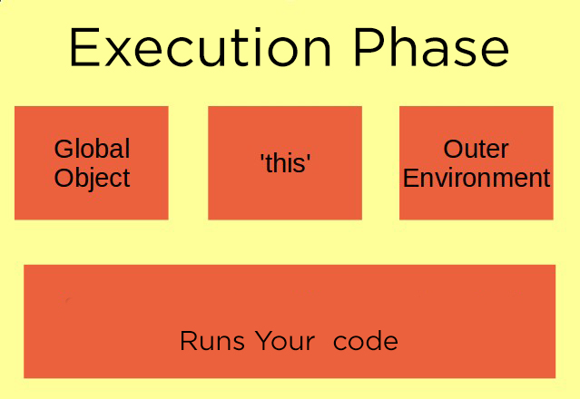
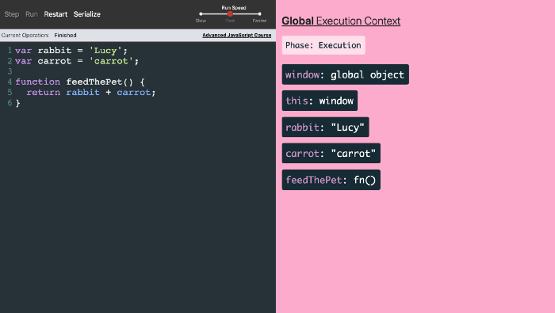
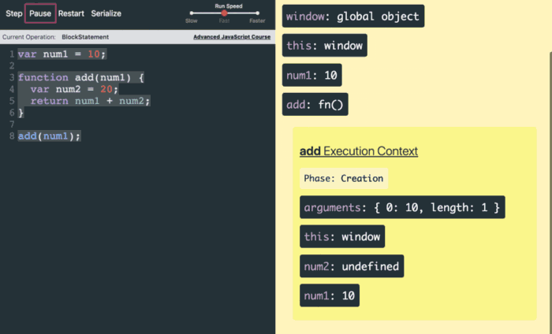
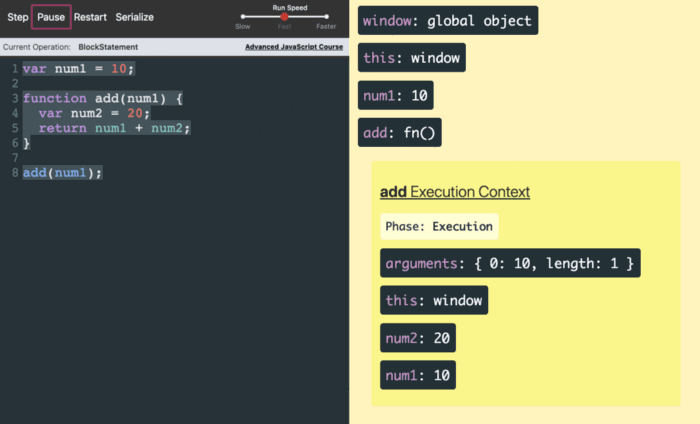
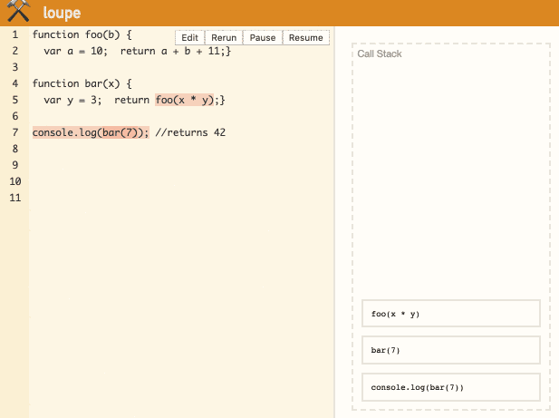

## JS Execution

There are two places that you can execute your JavaScript code. It is either inside the `browser` or `Node.js`. You cannot execute JavaScript code outside these two. Node.js and all browsers use a `JavaScript Engine` to interpret and execute JavaScript code.

JS engines: Google V8 (Chrome, node.js), SpiderMonkey (Firefox)

## Syntax Parser (Compiler)

- A program that reads your code and determines what it does and if its grammar/syntax is valid.
- translates human readable code into computer instructions
- translates character by character

## Lexical Environment

- related to words or grammar or syntax
- where something sits in the code you write is important

## Global Execution Context (GEC)

- the default execution context when JavaScript Engine starts to interpret a JavaScript file either inside a browser or in Node.js
- a wrapper/environment to help manage the code that is running
- JS engine creates `window` Global object and `this` variable in the browser context. And `global` Global object in NodeJs
- `window = this`
- there is only one Global Execution context

## JS Engine: Global Execution Context Phases

### 1. Creation Phase

- create Global Object
- create this variable
- setup memory for variable and functions (`hoisting`)
- variables are initialized with `undefined`
- puts function declarations in memory





### 2. Execution Phase

- executes the code you have written line by line from top to bottom
- assigns real values to the variables




## Name/Value Pair

- a `name` which maps to a unique `value`
- a name may be defined more than once, but can only have one value at a <b>given context</b>
- value may be other name-value pairs

  ```
  // name can have only one value
  name: 'value'

  // value can be more name:value
  city: {
        name: 'New York',
        code: 1234
      }
  ```

## Hoisting

- variables and functions are lifted up to the top during the global execution; creation phase
- variables are initialized as undefined
- puts function declarations in memory

  ```
  console.log(a);
  b();

  var a = 123;

  function b(){
    console.log('hi');
  }

  // Output
  undefined
  hi
  ```

  Above code executes as if;

  ```
  // variables & function hoisted
  var a;

  function b(){
    console.log('hi');
  }

  console.log(a);
  b();

  var a = 123;

  // Output
  undefined
  hi
  ```

## Single Threaded

- one command runs at a time

## Synchronous

- one line at a time

## Function Invocation

- running/calling a function
- `()` is used to invoke the functions

  ```
  function learnJS(){
  }

  // invoking learnJS function
  learnJS();
  ```

## Function Execution Context (FEC)

- every function call creates new Function Execution Context (FEC) for that function
- function execution context has: `Creation` and `Execute` phases
- FEC exists inside the global context and will has access to variables in its parent context (GEC)
- creates extra `arguments` object
- setup memory for variables and functions in `Creation Phase`




In above example we have `num1` as a global variable and our function has `num2` as a local variable. `num2` only exists as long as the function is executing. `num2` is inside the function execution Context. So, when the function is done executing, `num2` does not exist anymore. This FEC has access to `this`, `num1` variables of GEC, so they have real values in the creation phase of this FEC.

## Execution/Call Stack

- stack of functions execution contexts
- every function execution context is added to call stack
- stack works in LIFO concept

  

## Scope Chain

- inner functions has access to variables of outer environment
- looking for variables not available within a function to outer scope.

```
function b(){
  console.log(myVar);
}

function a(){
  var myVar = 2;
  b();
}

var myVar = 1;
a();

// Output
1
```

In above; `b()` has access to global `myVar` not of `a()`. `myVar` is not available within `b()`, so it looks at outer environment. This process is known as scope chain.

```
function a(){
  var myVar = 2;

  function b(){
    console.log(myVar);
  }
}

var myVar = 1;
a();

// Output
2
```

In above; `myVar` is not available within `b()`, so it looks at outer environment i.e. function `a()` in this case. `myVar` is available at `a()` and prints the value. If `myVar` was not available within `a()`, function `b()` will look at global environment.

## VAR vs LET

1. Scopes

   `var` is function scoped

   `let` is block `{...}` scoped

2. Global Properties

   - global `var` variables are added to the global object as properties. The global object is `window` on the web browser and `global` on Node.js,

     ```
     var counter = 0;
     console.log(window.counter); //  0
     ```

   - global let variables are not added to the global object

     ```
     let counter = 0;
     console.log(window.counter); // undefined
     ```

3. Re-declaration

   - `var` keyword allows you to redeclare a variable without any issue.

     ```
     var counter = 10;
     var counter;
     console.log(counter); // 10
     ```

   - re-declaring a variable with the `let` keyword will get an error.

     ```
     let counter = 10;
     let counter; // error
     ```

4. Temporal dead zone

   - Creation and Execution

     The `var` variables

     <i>Creation phase:</i> the `var` variables are assigned storage spaces and immediately initialized to `undefined`.

     <i>Execution phase:</i> the `var` variables are assigned the values specified by the assignments if there are ones. If there aren’t, the values of the variables remain `undefined`.

     <br>

     The `let` variables

     <i>Creation phase:</i> the `let` variables are assigned storage spaces but are not initialized. Referencing uninitialized variables will cause a `ReferenceError`.

     The `let` variables have the same execution phase as the var variables.

   The temporal dead zone starts from the block until the let variable declaration is processed. In other words, it is where you cannot access the let variables before they are defined.

## Function

- Functions creates `arguments` object on creation phase.

- Js functions are special type of object

  ```
  function func(){
  ...
  }

  func.name = 'something'; // can add properties to a function
  console.log(func.name); // something
  ```

## Function Statement vs Function Expression

- ### Function Statement

  - doesn't return a value.

  Statement:

  ```
  if(){..}  //doesn't return any value
  ```

  Function Statement:

  ```
  function func(){
    console.log('hi');
  }
  ```

- ### Function Expression

  - returns a value.

  Expression:

  ```
  1 + 3;  // returns 4
  a = 3;  // returns 3

  output:
  4
  3
  ```

  Function Expression:

  ```
  // anonymous function
  // returns function object to the variable

  var func = function(){
    console.log('hi');
  }
  ```

## Prototype Inheritance

- almost every object is linked to another object. That link is know as prototype.
- objects inherits properties and methods from it's prototype ancestry.
- objects are linked as prototype chain
- every object has a `__proto__` property
- object prototype can be set by user.

```
var parent = {
  parentMethod: function(){
    console.log(this.greet);
  }
}

// object constructor
var child1 = function(greet){
  this.greet = greet;
}

var child2 = {
  ...
}

// creating prototypes

// Method 1 - object constructor
child1.prototype = parent;
obj1 = new child1('hi');
obj1.parentMethod();

// Method 2 - normal object
var obj = Object.create(parent);
obj.parentMethod();

// Method 3 - normal object
Object.setPrototypeOf(child2, parent);
child2.parentMethod();

```

## JS Object

- In JS, anything except primitive data types, are objects.

  Primitive data types: number, string, boolean, undefined, symbol

  Objects: Js object, array, functions

## Object Constructor

- "blueprint" for creating many objects of the same "type".
- name constructor functions with an upper-case first letter.

  ```
  // Person object constructor

  function Person(first, last) {
    this.firstName = first;
    this.lastName = last;
    this.name = function() {return this.firstName + " " + this.lastName;};
  }
  ```

- cannot add new property and methods to object constructor as normal object

  ```
  Person.age = 20;  // invalid ❌

  // valid way ✅
  // new props and methods are added to object constructor manually.

   function Person(first, last) {
    this.firstName = first;
    this.lastName = last;
    this.name = function() {return this.firstName + " " + this.lastName;};
    this.age = 20;
  }
  ```

## `this` Keyword

- in JS this refers to current object.
- this refers to different object depending on call context.

  ```
  // Global Context

  console.log(this);   // refers to window object

  // Object context

  var obj = {
    show: function(){return this;} // refers to obj object;
  }

  // Function Context

  function func1(){
    return this; // refers to window object in non-strict mode
  }
  function func2(){
    return this; // is undefined in strict mode
  }

  ```
